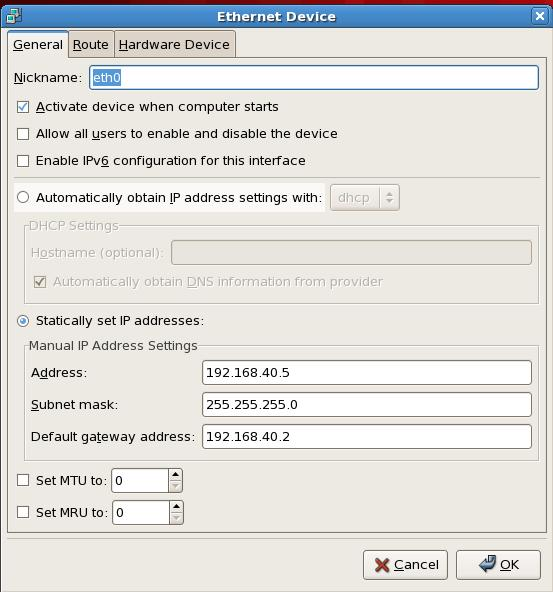

## VMware中redhat联网设置 ##
VMware中提供3中上网方式，Bridged(桥接模式)、NAT(网络地址转换模式)、Host-only(主机模式)。

### 1. Bridged(桥接模式) ###
	在桥接模式下，VMware虚拟出来的操作系统就像是局域网中的一独立的主机，它可以访问网内任何一台机器。
	不过你需要多于一个的IP地址，并且需要手工为虚拟系统配置IP地址、子网掩码，
	而且还要和宿主机器处于同一网段，这样虚拟系统才能和宿主机器进行通信。
	如果你想利用VMware在局域网内新建一个虚拟服务器，为局域网用户提供网络服务，就应该选择桥接模式。
### 2. NAT(网络地址转换模式) ###
	使用NAT模式，就是让虚拟系统借助NAT(网络地址转换)功能，通过宿主机器所在的网络来访问公网。
	也就是说，使用NAT模式可以实现在虚拟系统里访问互联网。
	NAT模式下的虚拟系统的TCP/IP配置信息是由VMnet8(NAT)虚拟网络的DHCP服务器提供的，
	无法进行手工修改，因此虚拟系统也就无法和本局域网中的其他真实主机进行通讯。
	采用NAT模式最大的优势是虚拟系统接入互联网非常简单，你不需要进行任何其他的配置，
	只需要宿主机器能访问互联网即可。如果你想利用VMware安装一个新的虚拟系统，
	在虚拟系统中不用进行任何手工配置就能直接访问互联网，建议你采用NAT模式。
### 3. Host-only(主机模式) ###
	在某些特殊的网络调试环境中，要求将真实环境和虚拟环境隔离开，这时你就可采用Host-only模式。
	在Host-only模式中，所有的虚拟系统是可以相互通信的，但虚拟系统和真实的网络是被隔离开的。
	可以利用Windows XP里面自带的Internet连接共享(实际上是一个简单的路由NAT)来让虚拟机
	通过主机真实的网卡进行外网的访问。虚拟系统的TCP/IP配置信息(如IP地址、网关地址、DNS服务器等)，
	都是由VMnet1(Host-only)虚拟网络的DHCP服务器来动态分配的。  
	如果你想利用VMware创建一个与网内其他机器相隔离的虚拟系统，进行某些特殊的网络调试工作，
	可以选择Host-only模式。

由于我本地只有一个Ip，所以重点介绍下NAT（网络地址转换模式）
VMware中点编辑->虚拟网络编辑器，选择VMnet8 Nat设置子网Ip和子网掩码。

打开NAT设置，添加端口映射，虚拟机Ip地址是你本地主机的IP	

然后打开“网络连接”，设置VMware Network Adapter VMnet8属性

设置ip地址

在虚拟机redhat中打开system->administration->network。

打开 Network configurtion,设置eth0

	设置address,subnetmask,default gateway address

    设置DNS和你主机的DNS相同

